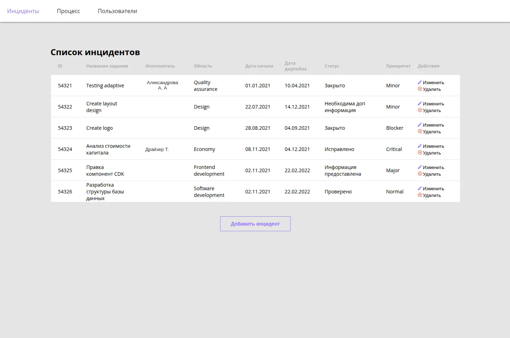
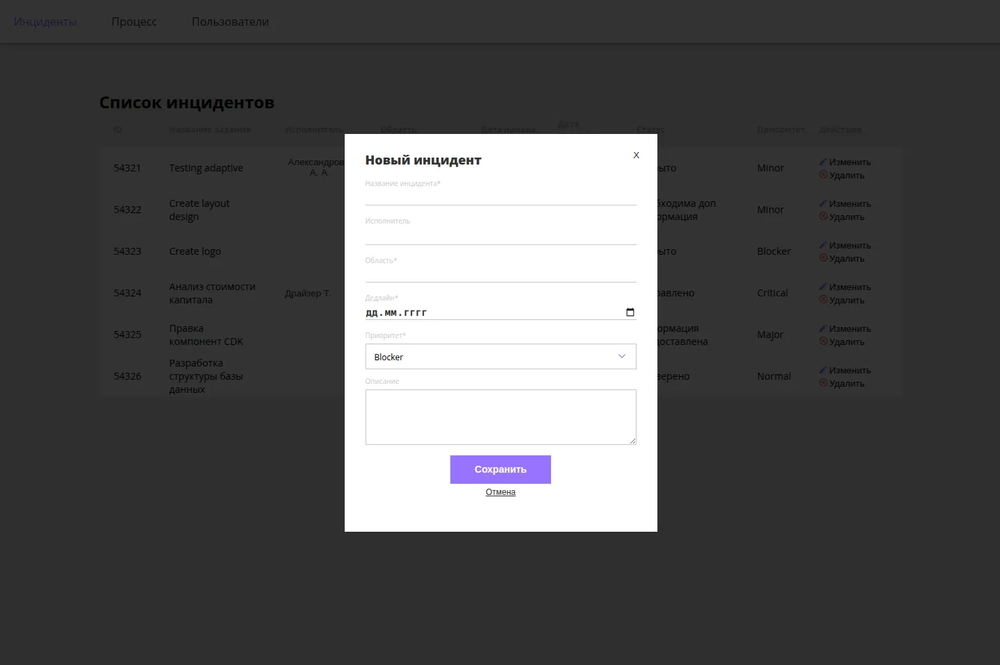
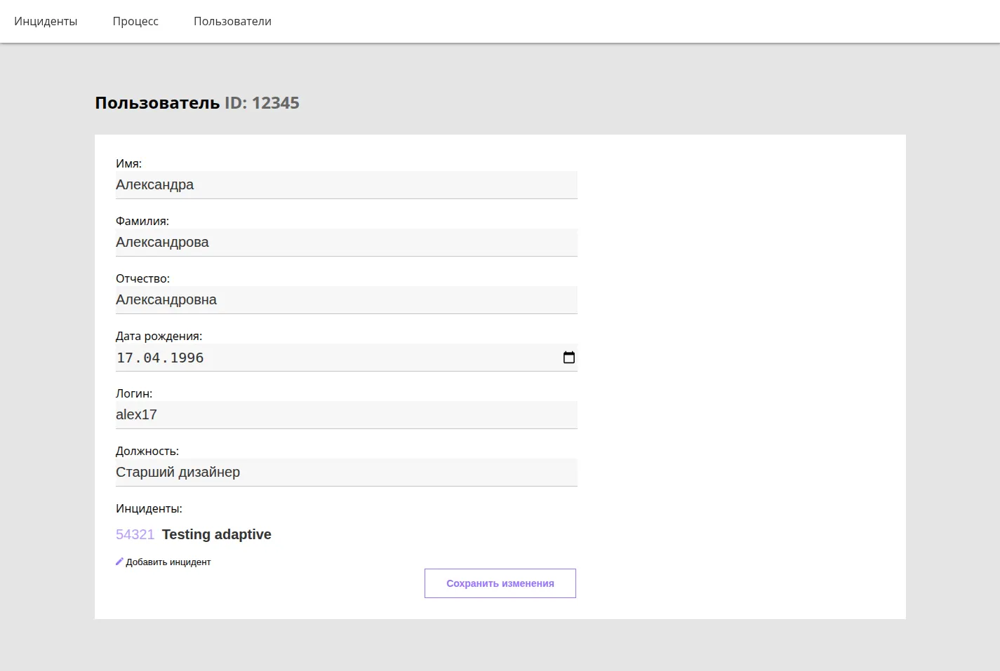

# Incident Tracker

**English** | [Русский](README.ru.md)

An incident tracking app for an enterprise team, built with Angular 12, NgRx and TypeScript: incidents, users, and the links between them, stored in the browser's `localStorage`. The UI is in Russian.

> 🏁 **Course capstone** · Netcracker Frontend School · 2021. A mentored final project: the brief offered localStorage, a BaaS or a custom backend for persistence, and this branch implements localStorage. Fixes made in 2026 are listed in [Changed afterwards](#changed-afterwards).

**Live demo:** https://netcracker-projects-eta.vercel.app

<p>
  
</p>

## Highlights

- **Persistence without a backend or Effects.** A small sync service per module subscribes to its NgRx slice, writes it to `localStorage` on every change and rehydrates it on load.
- **Sync across browser tabs.** The same service listens to the `storage` event, so a change made in one tab shows up in the others.
- **One NgRx slice per feature module.** `incident` and `user` each own their `actions` → `reducer` → `selector`.
- **No UI framework.** The select, the search input with autocomplete and the full-name pipe are written from scratch in `modules/cdk/`; styles are hand-written Less.

## Features

- Incident list as a table: ID, title, assignee, area, start and due dates, status, priority.
- Creating an incident in a popup; the assignee is picked with a search by name or ID.
- Incident page with editable due date, assignee, description and status.
- User list, user creation popup (full name, login, date of birth, position) and user page.
- Linking incidents to a user from the user page.
- Validation: required fields, due date not in the past, full names without digits.

<p>
  
  
</p>

## Tech stack

| Area | Tools |
| --- | --- |
| Framework | Angular 12, TypeScript 4.3 |
| State | NgRx Store, Store DevTools |
| Persistence | `localStorage` |
| Styles | Less, no UI framework |
| Hosting | Vercel (static SPA) |

## Architecture

```
component ──► store.dispatch(action) ──► reducer ──► selector ──► component
                                            │
                                            ▼
                         sync service ──► localStorage ──► other tabs ('storage' event)
```

1. Each feature module keeps its NgRx slice in `store/`: for example [incident.actions.ts](project/src/app/modules/incident/store/incident.actions.ts), [incident.reducer.ts](project/src/app/modules/incident/store/incident.reducer.ts), [incident.selector.ts](project/src/app/modules/incident/store/incident.selector.ts).
2. The initial state comes from seed data in `data/` ([incidents.ts](project/src/app/modules/incident/data/incidents.ts), [users.ts](project/src/app/modules/user/data/users.ts)).
3. [incident-sync-storage.service.ts](project/src/app/modules/incident/service/incident-sync-storage.service.ts) and [user-sync-storage.service.ts](project/src/app/modules/user/service/user-sync-storage.service.ts) load the saved state into the store on startup, then mirror every change back to `localStorage`.

```
project/src/app/modules/
├── incident/     # incident list, popup, incident page, NgRx slice, sync service
├── user/         # user list, popup, user page, NgRx slice, sync service
├── process/      # placeholder for the workflow settings
├── cdk/          # shared select, search input and full-name pipe
└── not-found/    # 404 page
```

### Key decisions

- **A sync service instead of Effects.** With no API to call, a subscription to the store is enough to persist state.
- **Hand-written components.** The brief ruled out UI frameworks, so the select and the search input are custom.

### Related branches

- [`mongoDb`](https://github.com/BarbaraFromTonshaevo/netcracker-projects/tree/mongoDb) — a later iteration of the same project with a custom Express + MongoDB REST API instead of `localStorage`. It isn't deployed yet; see that branch's README for status.

## Changed afterwards

- Added the missing `@ngrx/store` and `@ngrx/store-devtools` dependencies and pinned Node 16 via Volta so the project builds again.
- Configured SPA routing for Vercel in [project/vercel.json](project/vercel.json).
- Fixed date formatting in the edit forms: `getDay()` was used instead of `getDate()`, and dates rehydrated from `localStorage` as strings crashed the form.
- Fixed linking incidents to a user: after adding one incident, the Add button stayed disabled.
- Removed leftover debug `console.log` calls; added this README and the screenshots.

## Getting started

Requires Node.js 16 (pinned via Volta in [project/package.json](project/package.json)). No backend or database is needed.

```bash
cd project
npm install
npm start            # http://localhost:4200
```

Other scripts:

```bash
npm run build        # production build into dist/
npm test             # Karma + Jasmine
```

## Deployment

Deployed on Vercel from the `project/` directory. [project/vercel.json](project/vercel.json) rewrites all paths to `index.html` so that routes like `/users` open directly.

## Known limitations

- The **Process** tab (configurable status workflow) is a placeholder on this branch.
- There is no mobile layout.
- Form validation adds CSS classes through `document.querySelector` instead of using Angular forms.
- Tests are only the stubs generated by Angular CLI.
- Angular 12 is outdated and requires Node 16, hence the Volta pin.

## What I'd improve

- **Reactive Forms** for validation instead of manual DOM manipulation.
- **Effects and an API** instead of the sync services, as in the [`mongoDb`](https://github.com/BarbaraFromTonshaevo/netcracker-projects/tree/mongoDb) branch.
- **An Angular upgrade** to a current version.
- **The Process module:** configurable statuses and transitions between them.
- **A responsive layout** for tablets and phones.
